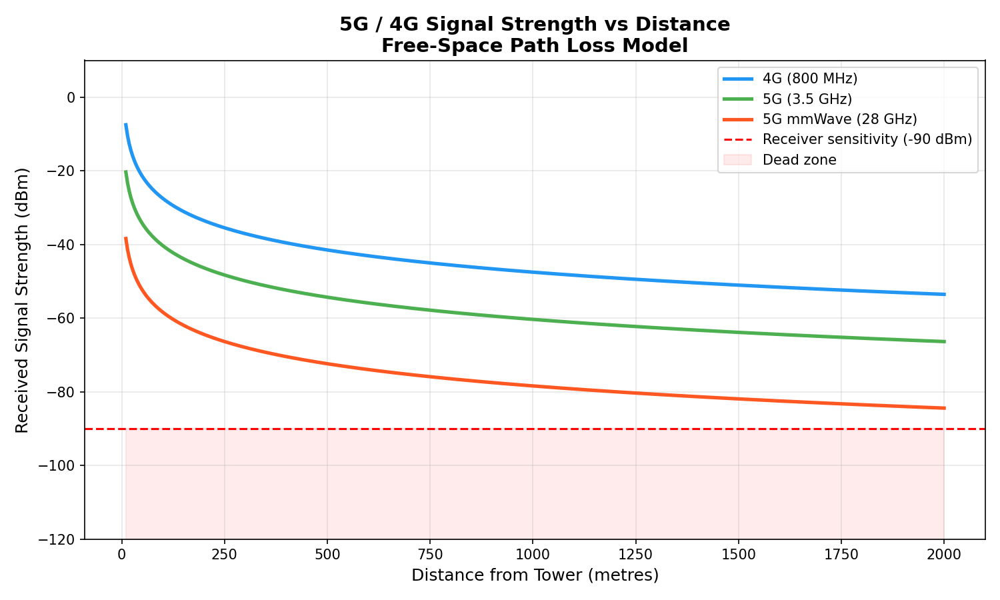

# 📡 5G / 4G Signal Strength Analyser

A Python simulation of signal strength vs distance using the 
Free-Space Path Loss (FSPL) model — the same formula used by 
Ericsson, Vodafone and Nokia engineers for network planning.

## What it does
- Models signal strength for 4G (800 MHz), 5G (3.5 GHz) and 5G mmWave (28 GHz)
- Shows the receiver sensitivity threshold (dead zone)
- Prints a results table at key distances

## How to run
```bash
pip install numpy matplotlib
python3 signal_analyser.py
```

## Result


## Skills demonstrated
- Python (NumPy, Matplotlib)
- RF propagation modelling
- 5G NR frequency bands
- Data visualisation

## Author
MSc Electronic & Communications Engineering Student — Ireland
